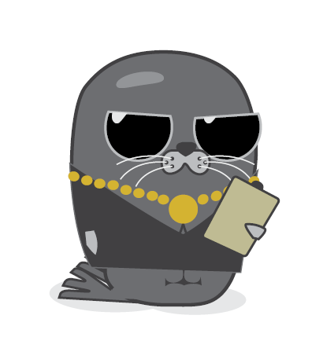

# S.E.A.L - the Super Easy Authorization Language

SEAL is an opinionated, strongly typed, declarative language with a grammar that’s easy to understand yet expressive enough to handle a variety of use cases.
# The SEAL Documentation

https://seal-auth.readthedocs.io/en/latest/index.html

# References
inspiration heavily taken from https://www.mobt3ath.com/uplode/book/book-58878.pdf

